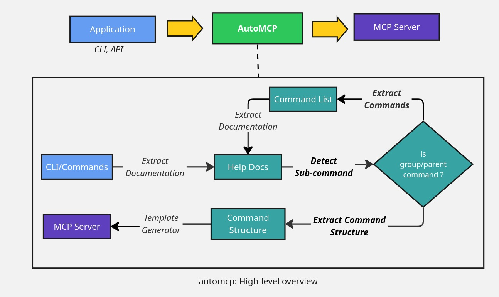

# AutoMCP: Convert any CLI tool, API or program for Agentic Use

## What is AutoMCP?

Integrating traditional CLI tools and APIs with modern Large Language Models (LLMs) and agentic platforms is often a complex and time-consuming process. Developers typically need to write custom servers, wrappers, or interfaces to make their tools accessible to LLMs, slowing down innovation and interoperability.

AutoMCP solves this problem by providing an automated framework that bridges the gap between existing CLI tools, APIs, and the latest interoperability standards for LLMs, such as the Model Context Protocol (MCP). With AutoMCP, developers can rapidly extend their tools for LLM and agentic use—without having to manually implement new servers or utilities—enabling faster integration, experimentation, and adoption in AI-driven workflows.


## 🌟 Key Features

- **MCP Server**
- **Supported Protocols**: 
    - [Model Context Protocol (MCP)](https://modelcontextprotocol.io/)
    - [Universal Tool Calling Protocol (UTCP)](https://www.utcp.io) [Future Scope]
    - [Agent2Agent (A2A)](https://github.com/a2aproject/A2A) [Future Scope]
- MCP Gateway [Future Scope]
- API Support (OpenAPI and Swagger) [Future Scope]


## 🚦 Getting Started

### Pre-requisites

- OpenAI-compliant LLM Service (Mistral Small, Llama 3.3, Granite 3, 8b+ model)
- Python 3

## Environment Setup

```
# Setup virtual environment
pip install uv
uv venv --python 3.9
source .venv/bin/activate

# Install Dependencies
uv sync

# Install automcp
uv pip install -e .
```

## LLM Setup

Create `.env` file: `cp .default_env .env`

Update the following properties in the `.env` file:

- **MODEL_BASE_URL**: OpenAI base url for LLM (/v1 endpoint)
- **MODEL_KEY**: API token for LLM.
- **MODEL_NAME**: Name of the LLM model.

## Usage

AutoMCP can be run in two modes: as a standalone CLI tool, or as an MCP server that you can connect to using your preferred MCP clients or hosts.

### 💻 Mode 1: Standalone

In the standalone mode, the automcp can take CLI programs as input and output the MCP server.

```
source .env

# Run automcp
uv run automcp --help

# Generate mcp server for a podman command
uv run automcp create -p "podman images" -o ./server.py
```

### 🖥️ Mode 2: MCP Server 

AutoMCP also provides MCP server that lets you create MCP servers from a MCP client. 

You can start the MCP server with automcp cli by running the command:

```
uv run automcp run
```

If you want to register the AutoMCP MCP server in cursor or claude, then you can add the following json configuration to your `mcp.json`:

```json
"automcp-server":{
    "command": "uv",
    "args": [
        "run",
        "automcp",
        "run"
    ],
    "env": {
        "MODEL_BASE_URL": "...",
        "MODEL_KEY": "...",
        "MODEL_NAME": "..."
    }
}
```

Currently users need to manually register the ouput server with their tools.


## ⚙️ How it works?



automcp uses an LLM workflow to process CLI help documentation and generate MCP server. 

At the core of project, is the [llm modules](./automcp/llm/) that defines multiple LLM agents each used in different parts of the CLI help text processing.

1. [Detect Sub-Command](./automcp/llm/tasks/detect_sub_commands.py): This agent is responsible for evaluating whether the given help text contains sub-commands or not.

2. [Extract Command List](./automcp/llm/tasks/extract_command_list.py): Agent to extract list of sub-commands.

3. [Extract Command](./automcp/llm/tasks/extract_command.py): Agent to extract command details (description, arguments, flags, etc).

The interaction with the actual LLM server is done through the standard [OpenAI client](https://github.com/openai/openai-python). LLM outputs are structured by using OpenAI client [support](https://platform.openai.com/docs/guides/structured-outputs?api-mode=chat) for [PyDantic](https://docs.pydantic.dev/latest/) Data Modeling library.


The generation of MCP server is done through Jinja2 templating library and you can find the details about the generator and template under [templates](./automcp/templates/) directory.


## ⚠️ Limitations

- The MCP server registration with tools like Cursor or Claude must currently be done manually.
- Only supports CLI tools with standard help output; highly custom or interactive CLIs may not be parsed correctly.
- LLM-based extraction may occasionally misinterpret complex or ambiguous help texts.
- Generated MCP servers may require manual review or adjustment for edge cases.
- Performance and accuracy depend on the quality of the underlying LLM and help documentation.
